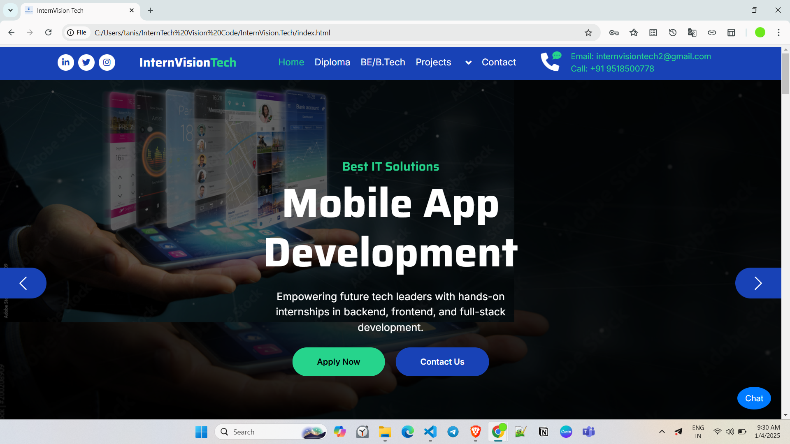
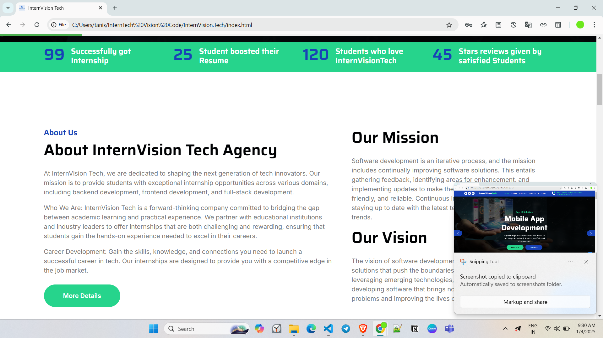
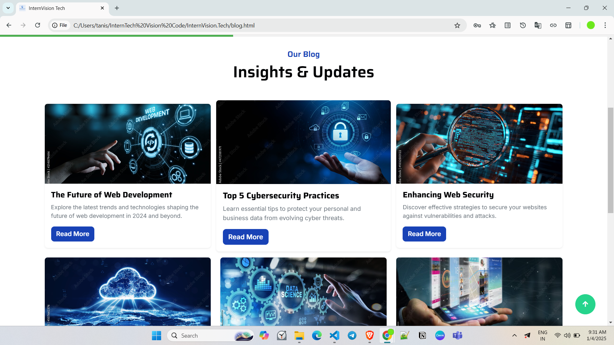
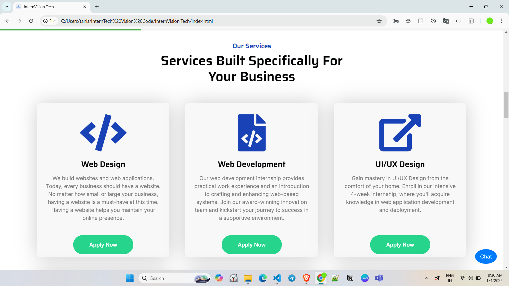
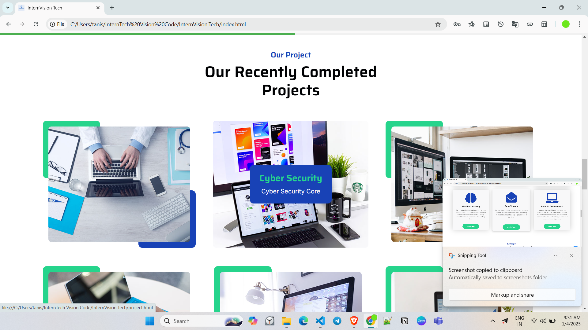
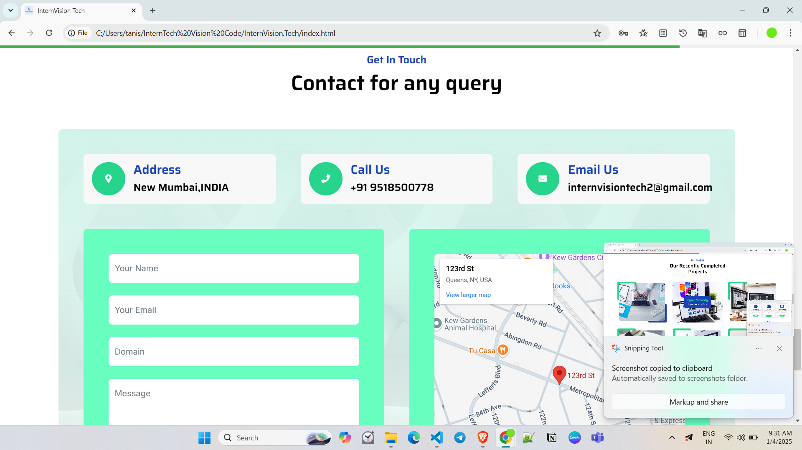
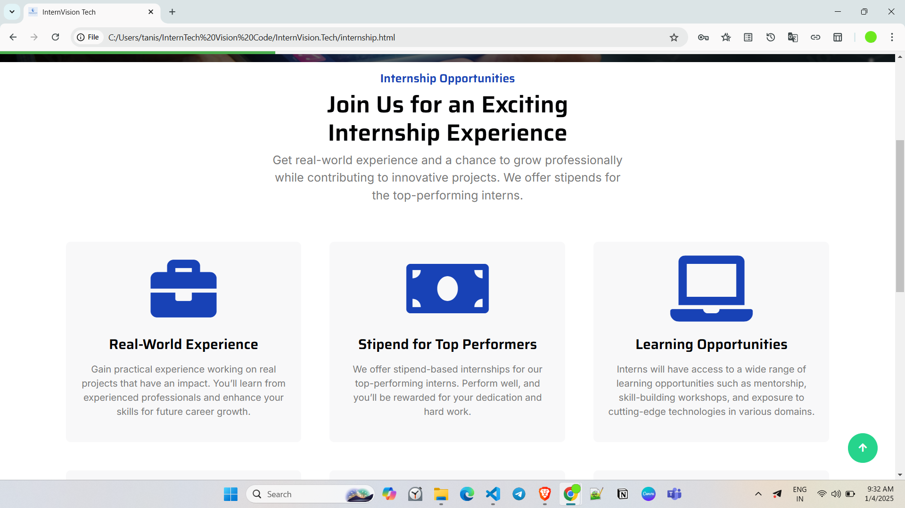
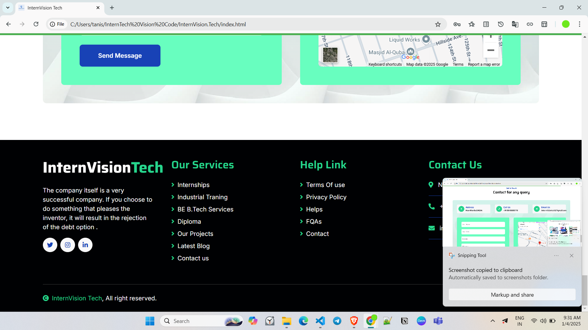

# InternVision Tech Website 🌐  

Welcome to the official repository of **InternVision Tech**'s website! This project serves as the digital presence of InterVision Tech, showcasing our services, portfolio, and capabilities in web development and design.

---

## 🚀 Features  
- **Landing Page**: A visually appealing and informative home page designed to captivate visitors.  
- **CMS Integration**: Dynamic and easy-to-manage content for a seamless user experience.  
- **UI/UX Design**: Sleek, modern, and user-centric interface and experience.  
- **E-Commerce Functionality**: Comprehensive online store setup to drive sales.
- **Payment Modes**: Secure and flexible payment gateways for seamless transactions.  
- **Chatbot Integration**: AI-powered chatbot for 24/7 customer support and engagement. 

---

## 🛠️ Technologies Used  
- **Frontend**: HTML5, CSS3, JavaScript, and frameworks like React (if applicable).  
- **Backend**: Node.js, Express.js, or any other backend technology (if applicable).  
- **Database**: MongoDB, MySQL, or any other database solution (if applicable).  
- **Version Control**: Git & GitHub for collaborative development.


---

## 📂 Project Structure  
```
InternVision.Tech/
├── src/
│   ├── components/       # Reusable components
│   ├── pages/            # Individual pages (Landing, About, Services, etc.)
│   ├── styles/           # Global and component-specific styles
│   └── assets/           # Images, icons, and other assets
├── public/               # Static files
├── package.json          # Dependencies and scripts
└── README.md             # Project documentation
```

---

## 📖 Getting Started  

### Prerequisites  
Ensure you have the following installed on your machine:  
- Node.js  
- npm or yarn  
- Git  

### Installation  
1. Clone the repository:  
   ```bash
   git clone https://github.com/Suraj-Pathade/InternVision.Tech.git
   ```
2. Navigate to the project directory:  
   ```bash
   cd InternVision.Tech
   ```
3. Install dependencies:  
   ```bash
   npm install
   ```

### Development Server  
Start the development server:  
```bash
npm start
```

### Build for Production  
To build the project for production:  
```bash
npm run build
```

---

## 🖼️ Screenshots  
_Showcase of website with screenshots._  

### Landing Page  


### About InternVision Tech Page  


### Blogs & Updates Page  


### Services Page  


### Projects Page  


### Contact us Page  


### Internships Page  


### Footer Page  



---

## 🤝 Contributing  
We welcome contributions! If you'd like to contribute, please fork the repository and use a feature branch. Pull requests are warmly welcome.  

---

## 📧 Contact  
For any queries, reach out to us at:  
- **Email**: intervisiontech2@gmail.com  
- **Website**: [www.intervisiontech.com](https://suraj-pathade.github.io/InternVision.Tech/index.html)  

---

## 📜 License  
This project is licensed under the MIT License. See the [LICENSE](LICENSE) file for details.  

---

### 🌟 Show Your Support  
If you find this project useful, please ⭐ the repository to show your support!  
```

Thank You ☺️
